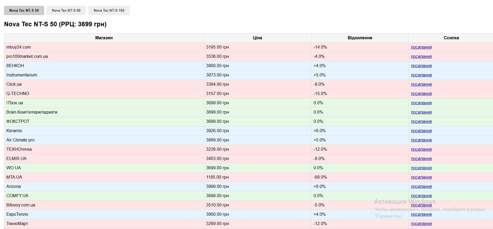

# Nova tec water heater Price Monitor (Моніторинг цін водонагрівачів Nova tec)

A Django-based web application that monitors prices for Nova Tec water heaters listed on [hotline.ua](https://hotline.ua), compares them to the official Recommended Retail Price (RRP), and displays results in a dashboard with color-coded indicators.



---

## 🔧 Features

- Scrapes current product prices using Selenium with scroll and anti-bot detection bypass
- Compares prices to RRP and highlights:
  - 🟢 Green — price matches RRP
  - 🔴 Red — price is below RRP
  - 🔵 Blue — price is above RRP
- Displays results in a tabbed interface per product model
- Shows % deviation from RRP
- Logs scraping process for debugging
- Admin interface via Django ORM

---

## 💻 Technologies

- Python 3.11+
- Django 5.x
- Selenium with ChromeDriver
- BeautifulSoup4
- pipenv (virtual environment & dependency manager)

---

## 📦 Installation

### 1. Clone the project

```bash
git clone https://github.com/artnatan/hotline_parser_GP
cd hotline_parser_GP
```

### 2. Create virtual environment (with pipenv)

```bash
pipenv install
```

### 3. Run database migrations

```bash
pipenv run python manage.py migrate
```

### 4. Scrape prices

```bash
pipenv run python manage.py parse_hotline
```

This will generate or update `hotline_prices.csv` and populate the database with current offers.

### 5. Start the development server

```bash
pipenv run python manage.py runserver
```

Then open [http://127.0.0.1:8000/](http://127.0.0.1:8000/) in your browser.

---

## 📊 Dashboard Example

The dashboard shows offers for each model in separate tabs.

| Model     | Shop    | Price (UAH) | Status   |
|-----------|---------|-------------|----------|
| NT-S 50   | Shop A  | 3699        | 🟢 Match |
| NT-S 50   | Shop B  | 3499        | 🔴 Below |
| NT-S 100  | Shop C  | 5050        | 🔵 Above |

---

## 🗂 Project Structure

```bash
hotline_price_monitor/
├── dashboard/           # Web UI
├── scraper/             # Price scraper
├── templates/
│   └── dashboard/
│       └── table.html   # Frontend template
├── manage.py
├── Pipfile              # Dependency definitions
```

---

## ⚠️ Notes

- The scraper simulates a real browser (Selenium + Chrome) to avoid anti-bot detection.
- Tested on Windows 10 with ChromeDriver installed automatically.
- Add your actual screenshot to the root as `screenshot.png` to enable preview.

---

## 📜 License

Copyright 2025 [Calabaraburus (Artem Natalchishin)]

Licensed under the Apache License 2.0.
